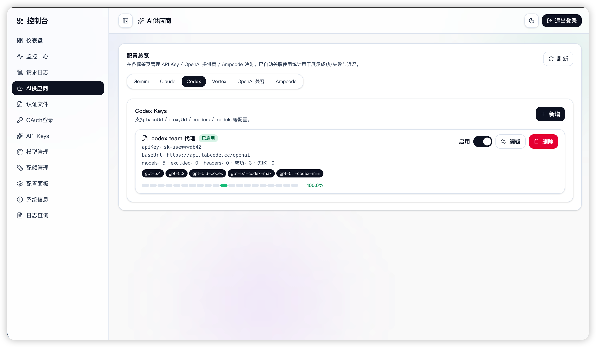
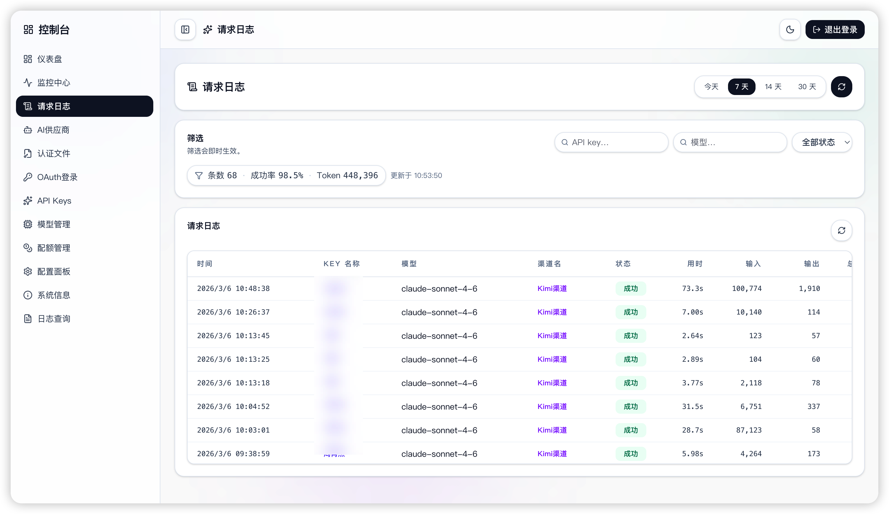

<p align="center">
  
  
  
  
  
</p>

<h1 align="center">🖥️ Code Proxy · Admin Dashboard</h1>

<p align="center">
  <strong>The official frontend management panel for <a href="https://github.com/kittors/CliRelay">CliRelay (CLI Proxy API)</a></strong>
</p>

<p align="center">
  <em>Monitor, manage, and configure your CLI proxy channels — all from a modern web UI.</em>
</p>

<p align="center">
  <a href="https://github.com/kittors/codeProxy/stargazers"></a>
  <a href="https://github.com/kittors/codeProxy/network/members"></a>
  <a href="https://github.com/kittors/codeProxy/issues"></a>
  <a href="https://github.com/kittors/codeProxy/blob/main/LICENSE"></a>
</p>

---

## ✨ Overview

**Code Proxy** is the official web-based admin panel for [**CliRelay**](https://github.com/kittors/CliRelay) — a proxy server that wraps Gemini CLI, Antigravity, ChatGPT Codex, Claude Code, Qwen Code, and iFlow as OpenAI/Gemini/Claude compatible API services.

This dashboard lets you:

- 🔐 **Login** with your API address and management key
- 📊 **Monitor** real-time KPI metrics, channel statistics, and model usage
- 🔗 **Manage** proxy channels (OpenAI, Gemini, Claude, Codex, Vertex, etc.)
- 📦 **Import/Export** usage snapshots for backup and migration
- ℹ️ **Inspect** system info, connection status, and available models

## 🧩 Features

| Feature | Description |
|---------|-------------|
| **Dashboard** | Overview cards with quick-access shortcuts to all management modules |
| **Monitor Center** | KPI metrics, channel distribution charts, model usage analytics |
| **System Info** | Connection status, version info, `/v1/models` model listing |
| **Auth Guard** | Session persistence with automatic token restoration |
| **Usage Snapshots** | Import & export usage data in JSON format |
| **Dark Mode** | Built-in dark theme with smooth transitions |
| **i18n Ready** | Internationalization support via i18next |

## 📸 Screenshots

<p align="center">
  
  
</p>
<p align="center">
  
  
</p>

## 🛠️ Tech Stack

| Category | Technology |
|----------|------------|
| **Framework** | React 19.2 + TypeScript 5.9 |
| **Build Tool** | Vite 7.3 |
| **Package Manager** | Bun 1.2 |
| **Styling** | Tailwind CSS v4 |
| **State Management** | Zustand |
| **Charts** | ECharts + Chart.js |
| **Animations** | Framer Motion + GSAP |
| **Routing** | React Router v7 |
| **Linting** | oxlint + oxfmt |
| **Testing** | Vitest + Playwright (E2E) |

## 🚀 Getting Started

### Prerequisites

- [Bun](https://bun.sh/) ≥ 1.2 (or Node.js ≥ 18)
- A running [CliRelay](https://github.com/kittors/CliRelay) backend instance

### Install & Run

```bash
# Clone the repository
git clone https://github.com/kittors/codeProxy.git
cd codeProxy

# Install dependencies
bun install

# Start dev server
bun run dev
```

The dashboard will be available at **http://localhost:5173/**

### Build for Production

```bash
# Lint & format
bun run lint
bun run format

# Type-check & build
bun run build

# Preview production build
bun run preview
```

### Run Tests

```bash
# Unit tests
bun run test

# E2E tests
bun run e2e
```

## 📁 Project Structure

```
src/
├── app/                 # Routing & auth guards
├── lib/                 # Constants, HTTP client, API layer
├── modules/
│   ├── auth/            # Authentication provider
│   ├── dashboard/       # Dashboard overview
│   ├── layout/          # App shell (sidebar + topbar)
│   ├── login/           # Login page
│   ├── monitor/         # Monitoring center
│   ├── system/          # System information
│   ├── ui/              # Shared UI containers
│   └── usage/           # Usage statistics
└── styles/              # Global styles & theme tokens
```

## 🔌 API Integration

This dashboard communicates with the CliRelay backend via the Management API:

| Endpoint | Method | Description |
|----------|--------|-------------|
| `/v0/management/config` | `GET` | Verify login & fetch configuration |
| `/v0/management/usage` | `GET` | Retrieve usage statistics |
| `/v0/management/openai-compatibility` | `GET` | OpenAI channel mapping |
| `/v0/management/gemini-api-key` | `GET` | Gemini channel mapping |
| `/v0/management/claude-api-key` | `GET` | Claude channel mapping |
| `/v0/management/codex-api-key` | `GET` | Codex channel mapping |
| `/v0/management/vertex-api-key` | `GET` | Vertex channel mapping |

> **Note:** The API base is automatically normalized to `{apiBase}/v0/management`

For full backend API documentation, see the [CliRelay Management API](https://help.router-for.me/management/api).

## 🤝 Contributing

Contributions are welcome! Please feel free to submit a Pull Request.

1. Fork the repository
2. Create your feature branch (`git checkout -b feature/amazing-feature`)
3. Commit your changes (`git commit -m 'Add some amazing feature'`)
4. Push to the branch (`git push origin feature/amazing-feature`)
5. Open a Pull Request

## 📄 Related Projects

- **[CliRelay](https://github.com/kittors/CliRelay)** — The backend proxy server (Go)
- **[CliRelay Guides](https://help.router-for.me/)** — Official documentation

## 📝 License

This project is open source. See the [LICENSE](LICENSE) file for details.

---

<p align="center">
  Made with ❤️ for the <a href="https://github.com/kittors/CliRelay">CliRelay</a> community
</p>
